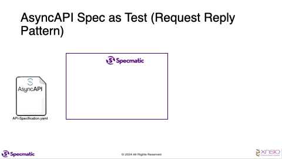

# Specmatic Kafka Sample

* [Specmatic Website](https://specmatic.io)
* [Specmatic Documenation](https://specmatic.io/documentation.html)

This sample project demonstrates how we can run contract tests against a service which interacts with a kafka broker. 

## Background
This project includes a consumer that listens to messages on a specific topic.
Upon receiving a message, the consumer processes it and publishes a new message to two other designated topics.




## Pre-requisites
* Gradle
* JDK 17+
* Docker

## Run the tests
```shell
./gradlew clean test
```

## Run the contract tests using specmatic-kafka docker image 

1. Start the kafka broker using Specmatic's Kafka Mock. [Note - You can use any kafka broker other than this too.]
    ```shell
    docker run -p 9092:9092 -p 2181:2181 -p 29092:29092 -v "$PWD/specmatic.yaml:/usr/src/app/specmatic.yaml" znsio/specmatic-kafka-trial virtualize
    ```
   Alternatively if you want to use a standard Kafka Docker image you can run below command.
   ```shell
   docker compose up
   ```
2. Run the application.
   ```shell
   ./gradlew bootRun
   ```
3. Run the contract tests.
   ```shell
   docker run --network="host" -v "$PWD/specmatic.yaml:/usr/src/app/specmatic.yaml" -v "$PWD/src/test/resources:/usr/src/app/examples" znsio/specmatic-kafka-trial test --examples=examples
   ```

## Get information around other CLI args exposed by specmatic-kafka docker image

1. To get information around all the CLI args of the `virtualize` command, run the following.
   ```shell
   docker run znsio/specmatic-kafka-trial virtualize --help
   ```
2. To get information around all the CLI args of the `test` command, run the following.
   ```shell
   docker run znsio/specmatic-kafka-trial test --help
   ```

## Docker commands to run the contract tests using specmatic-kafka docker image

```shell
docker run --network host -p 9092:9092 -p 2181:2181 -p 29092:29092 -v "$PWD/api-specifications/order-service-async-v3_0_0.yaml:/usr/src/app/order-service-async-v3_0_0.yaml" znsio/specmatic-kafka virtualize /usr/src/app/order-service-async-v3_0_0.yaml
```

```shell
docker run --network host -v "$PWD/api-specifications/order-service-async-v3_0_0.yaml:/usr/src/app/order-service-async-v3_0_0.yaml" znsio/specmatic-kafka test /usr/src/app/order-service-async-v3_0_0.yaml
```
